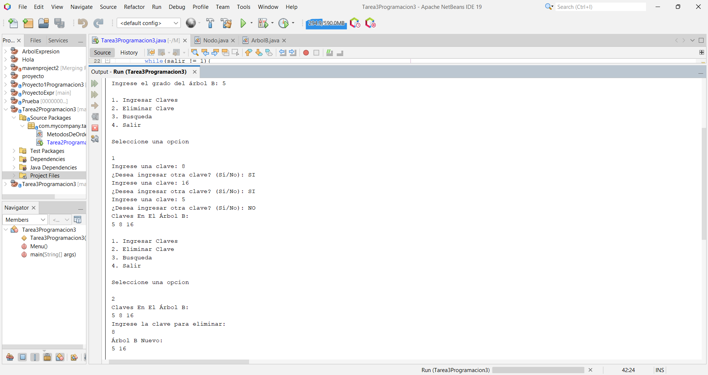

# Tarea 3 - Árbol B

Implementar las siguientes funciones en un árbol B utilizando lenguaje de programación java y solicitar el grado del árbol
* [x] Inserción de una clave
* [x] Eliminación de una clave
* [x] Búsqueda
  

